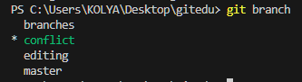
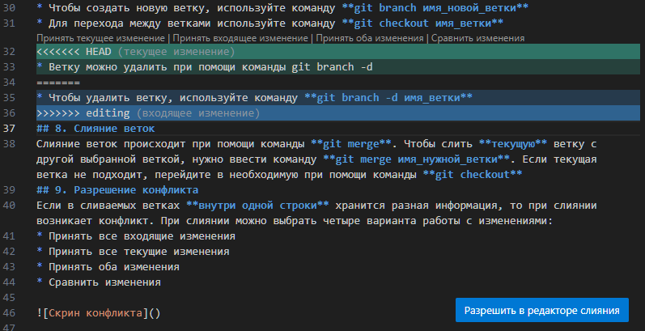
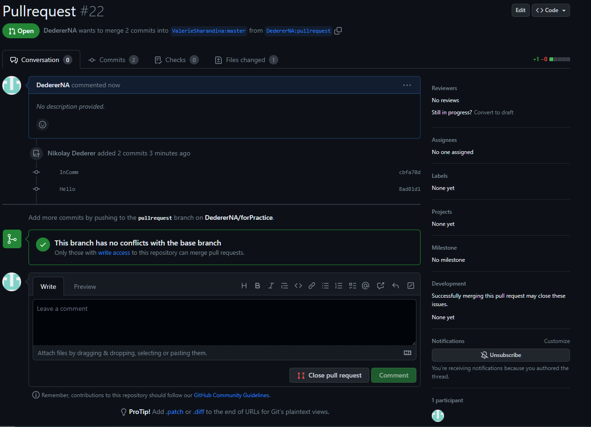

# Инструкция по Git
## 1. Проверка наличия установленного Git
В терминале выполняем команду **git --version**. Если Git установлен, появится информация о версии Git.
## 2. Настройка Git
При первом использовании Git надо представиться. Для этого в терминале вводим команды:
* **git --global user.email "Адрес электронной почты"**
* **git --global user.name "Имя пользователя"**
## 3. Инициализация репозитория
Чтобы подключить репозиторий Git, вводим команду **git init**. Чтобы проверить, инициализирован ли Git, вводим команду **git status**.
## 4. Сохранение изменений в файле
* Чтобы добавить файл к отслеживанию, вводим команду **git add .\имяфайла**
* Чтобы добавить комментарии к версии, вводим команду **git commit -m "Текст сообщения"**

Можно вводить команду **git commit -am "Текст сообщения"**, *если команда **git add** уже была введена*. Это объединяет две предыдущие команды.
## 5. Перемещение между сохранениями
* Чтобы увидеть историю всех изменений, вводим **git log**. В истории содержатся имена версий, между которыми можно перемещаться.
* Чтобы перемещаться между версиями, вводим команду **git checkout**.
* Чтобы вернуться в последнюю версию файла, вводим команду **git checkout master**.
## 6. Добавление картинок и игнорирование файлов
* Чтобы игнорировать файлы, нужно создать файл **.gitignore**. Этот файл является списком игнорируемых файлов.
* Чтобы добавить файл в список, нужно написать имя файла в **.gitignore**. Если ввести ***.расширение**, то будут игнорироваться все файлы этого расширения.
## 7. Ветвление
* Чтобы увидеть список веток, введите команду **git branch**. Текущая ветка отмечена зведочкой.

.

* Чтобы создать новую ветку, используйте команду **git branch имя_новой_ветки**
* Для перехода между ветками используйте команду **git checkout имя_ветки**
* Чтобы удалить ветку, используйте команду **git branch -d имя_ветки**
## 8. Слияние веток
Слияние веток происходит при помощи команды **git merge**. Чтобы слить **текущую** ветку с другой выбранной веткой, нужно ввести команду **git merge имя_нужной_ветки**. Если текущая ветка не подходит, перейдите в необходимую при помощи команды **git checkout**
## 9. Разрешение конфликта
Если в сливаемых ветках **внутри одной строки** хранится разная информация, то при слиянии возникает конфликт. При слиянии можно выбрать четыре варианта работы с изменениями:
* Принять все текущие изменения
* Принять все входящие изменения
* Принять оба изменения
* Сравнить изменения

1. В первом варианте применяются все изменения из **текущей ветки**. То есть, той ветки, к которой применялось слияние.
2. Во втором варианте применяются все изменения из **входящей** ветки. То есть, той ветки, которая указывалась в команде **git merge**.
3. В третьем варианте применяются **оба** изменения.
4. В четвертом варианте открывается редактор сравнения версий файла.

## 10. Создание удаленного репозитория
1. Для начала требуется создать аккаунт на сайте GitHub.com. 
2. Затем создайте на сайте GitHub репозиторий.
3. Чтобы создать удаленный репозиторий, используйте подказки на сайте GitHub:

* **git remote add origin https://github.com/user_name/repo_name.git**
* **git branch -M main**
* **git push -u origin main**
4. Если это делается впервые, то Git потребуется авторизация на GitHub.
5. В дальнейшем для отправления изменений на этот репозиторй используется команда **git push**.
6. Вы можете отправлять изменения, только если вы **имеете право** отправлять их на этот репозиторий.

## 11. Копирование удаленного репозитория
Чтобы скопировать репозиторий, используйте команду **git clone repo_url**, где repo_url -- адрес репозитория. Посмотреть его можно на GitHub, нажав кнопку **Code**.

Обратите внимание, что для работы в новом репозитории требуется перейти в папку с ним. Для этого используйте команду **cd**.

## 12. Pull
Чтобы подтянуть изменения из локального репозитория, используйте команду **git pull**. Обратите внимание, что эта команда производит **слияние** с локальной версией репозитория!

## 13. Pull-request
1. Чтобы предложить изменения в чужой проект на GitHub, для начала нужно создать его форк. Для этого нажмите кнопку **Fork**. Обратите внимание, что по умолчанию копируется только ветка master.
2. После этого у вас появилась форк-копия проекта на вашем аккаунте GitHub. Создайте **отдельную** ветку(и) и вносите ваши изменения именно в ней(их)!
3. Чтобы отправить изменения владельцу файла, выберете ветки с вашими изменения на GitHub и нажмите кнопку **Send pull-request**.
