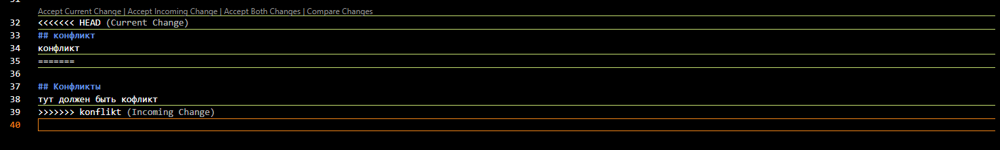

 
# Работа с GIT 1 урок
## Проверка наличия установленного GIT
В терминале выполняем команду git versoin. Если git установлен, то появится сообщение с информацией о версии файла. Иначе будет сообщение об ошибке.
## Настройка GIT
При первом использовании git необходимо представиться. Для этого надо ввести две команды: git config --global user.email, git config --global user.name
Для того, чтобы проверить прошла ли регистрация надо ввести команду --list
## Инициализация репазитория
Для того, чтобы получить репазиторий из папки, выполняем команду git init. В исходной папке появится скрытаю папка .git
## ДЗ задание
описать команды:
* git status
* git add
* git commit
* git log
* git diff
* git checout
## ДЗ ответ
* Команда git status отображает состояние рабочего каталога и раздела проиндексированных файлов.
* Команда git add добавляет изменение из рабочего каталога в раздел проиндексированных файлов.
* Команда git commit делает для проекта снимок текущего состояния изменений, добавленных в раздел проиндексированных файлов.
* Команда git log отображает отправленные снимки состояния и позволяет просматривать и фильтровать историю проекта, а также искать в ней конкретные изменения.
* Команда git diff используется для вычисления разницы между любыми двумя Git деревьями.
* Команда git checkout используется для переключения веток и выгрузки их содержимого в рабочий каталог.
## 2 Урок
## Добавление картинок и игнорирование файлов
Для того, чтобы разместить картинку в нашем файле необходимодобавить её в папку. После чего она отобразится  в проводнике. В нужном месте в файле прописываем следующую команду:
! 
Для того, чтобы удалить файлы с изображением из отслеживания, надо создать файл .gitignore

## Ветление
Для создания новой ветки необходимо ввести команду git branch и имя новой ветки. Ветвление необходимо для работы с файлами в отдельной ветке, сохраняя при этом исходное состояние файла до их слияния. Чтобы отобразить созданные ветки используется команда git branch. Чтобы перейти на другую ветку вводим в терминале команду git checkout и имя ветки.

## Cлияние веток
Чтобы слить любую ветку с текущей, вызываем git merge <имя ветки для слияния с текущей>
## Удаление веток
Если ветка text больше не нужна, ее можно удалить, то вводим команду git branch -d "название черновика"
## Удаление веток
Если ветка text больше не нужна, ее можно удалить, то вводим команду git branch -d "название черновика"

## Разрешение конфликтов
При работе в двух ветках одновременно может возникнуть ситуация, когда в одной и другой ветке мы по-разному изменили блок текста. Если затем мы попробуем слить эти ветки, Git сообщит о конфликте и предложит выбрать, какие же изменения записать. 

## конфликт
конфликт

## Конфликты
тут должен быть кофликт
Конфликты возникают при слиянии двух веток в одну и когда в этих ветках была изменена одна и та же строка (строки) файла. Разрешение конфликта возможно путем следующих методов: принять входящие изменения, текущие, оба изменения, сравнить изменения. Выглядит это так:

## ДЗ 2
Дополнить инструкцию своими скринами:
добавление картинок;
ветвление;
слияние веток;
разрешение конфликтов;
удаление веток.
Создать и слить минимум четыре ветки. Скрин этих веток должен быть в инструкции.

## Урок 3 ДЗ

## git push — это консольная команда, которая передаёт в удалённый репозиторий изменения, сделанные в локальном репозитории.

## Команда git pull используется для извлечения и загрузки содержимого из удаленного репозитория и немедленного обновления локального репозитория этим содержимым.

## git clone — это утилита командной строки Git для выбора существующего репозитория и создания его клона, т. е. копии. 

## git pull request — это запрос на вливание изменений из вашей ветки в основную ветку исходного репозитория.

## Fork - собственное ответвление ( fork ) какого-то проекта.