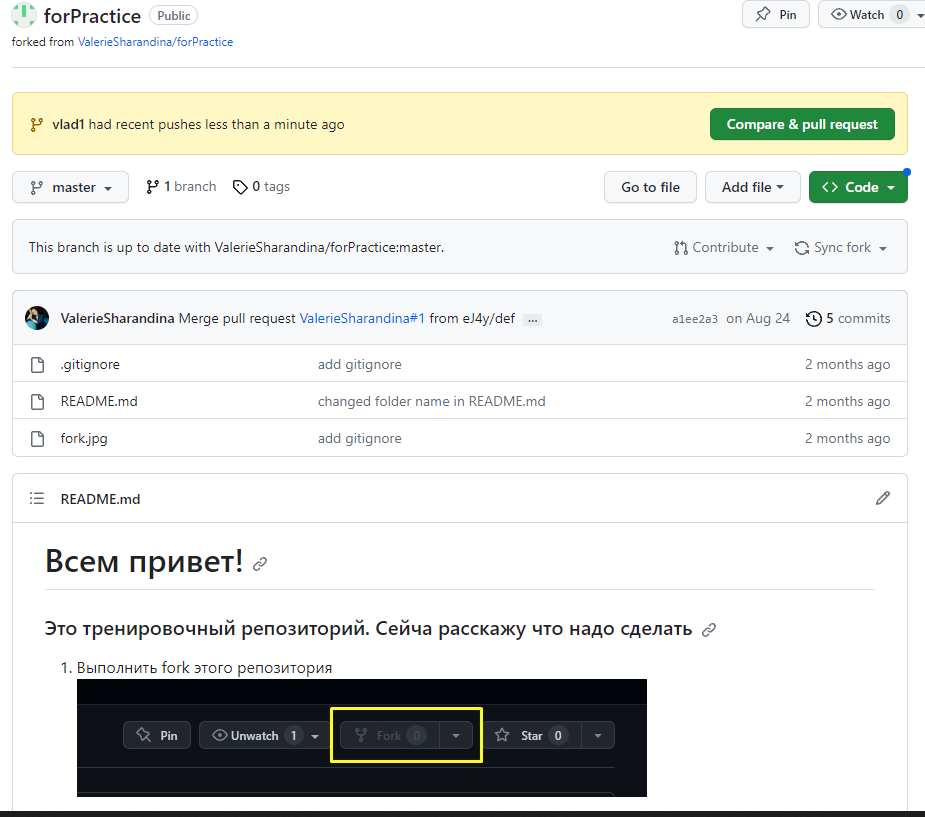

# Инструкция по GIt

## 1. Проверка наличия установленного Git

В терминале выполнием команду git vervion.
Если git установлен, то появится сообщение с информацией о версии файла.
**Иначе будет сообщение об ошибке.**

## 2. Установвка Git

Загружаем последнюю версию с сайта - https://git-scm.com/download/win

## 3. Настройка Git 

При первом использованни git необходимо представить, для этого нужно ввсести 2 команды.

git config --global user.email
git config --global user.name

Для того, чтобы провверить прошла ли регестрация нужно ввести команду: git config --list

## 4. Инициализация Репозитория

Прописываем команду git init 

В исходной папке появится скрытая папка .git 

## Домашка
 
1. ***Описать git status\ git add \ git commit \ git log \ git diff \ git checkout \ дописать 2 пункт*** 

## 5. Проверка Репозитория

Прописываем команду git status

Команда git status отображает состояние рабочего каталога и раздела проиндексированных файлов

## 6. Описание команды git add

Основное назначение команды git add состоит в переносе ожидающих изменений из рабочего каталога в раздел проиндексированных файлов Git

## 7. Описание команды git commit

Команда git commit берёт все данные, добавленные в индекс с помощью git add , и сохраняет их слепок во внутренней базе данных, а затем сдвигает указатель текущей ветки на этот слепок

## 8. описание команды git log

Команда git log используется для просмотра истории коммитов, начиная с самого свежего и уходя к истокам проекта.

## 9. Описание команды git diff

Команда git diff используется для вычисления разницы между любыми двумя Git деревьями.

## 10. Описание команды git checkout

 Команда checkout используется для копирования файлов из истории или сцены в рабочую директорию. Также она может использоваться для переключения между ветками.

 # 11. ДОбавление картинок и игнорироваввние файла

 Для того, чтобы разместить картинку в нашем файле:  нужно добавить её в папку и после этого в  нужном месте пишем 

 

 Для того, чтобы удалить файлы с изоброжением из отслеж нужно создать файл .gitignore

 # 12. Витвление 

 Для создания новой вветки, нужно вввести вв терминале команду git branch name

 Ветввление необходимо для работы с файлами в отдельной ветке, сохраняя при этом исходное состояние файла до их слияния

 Чтобы отобразить созданные вветки нужно прописать ***git branch***

 ЧТобы перейти на другую ветку пишем git ***checkout name_branch***

 # 13. Слияние вветок

 Для слияния веток и внисения изменений в наш основной файл использ команда git merge name_branch

 Слияние делается в ту ветку в которой мы находимся сейчас

 # 14. Конфликты

 Хочу увидеть конфликт
 тут точно должен быть конфликт
 Очень нужен конфликт
 Хочу уввидеть конфликт

Конфликты возникают при слиянии веток в одну ветку, при этом должна быть изменена одна и также строка файла

Конфликт выглядит ввот так

# Домашка

Слить 4 ветки\ создать конфлик \ прикрепить скрин

# Выполнение ДЗ

1. Создаю вветки

Добавил строку в vlad1

Так же добавил строку в vlad2

Сделал конфликт

Добавил скрин 

## 15. Подготовка к работе с удаленным репозиторием
Удаленный репозиторий - это проект, который располагается не на нашем компьютере, а в сети интернет, либо на другом компьютере, к которому имеется доступ по средствам локальной сети, на сервере и тд. Например сайт Git.Hub

Для работы с удаленными репозиториями необходимо зарегистрироваться на сайте. После этого нам предоставят доступ к работе с удаленными репозиториями.

Чтобы приступить к работе над каким-либо проектом на GitHub, необходимо сначала перейти к репозиторию данного проекта на сайте. Например, репозиторий pull request Андрея Булгакова

Для того чтобы работать с удаленным репозиторием на своем компьютере необходимо выполнить следующие действия:

После перехода на страницу разработчика проекта, необходимо в правом верхнем углу выбрать кнопку Fork. Вот так:
fork

Написать имя репозитория и нажать кнопку Creat Fork. После этого страница сайта обновиться, мы окажемся на странице своего аккаунта, где будет отображаться репозиторий добавленного проекта.
Для того чтобы забрать проект на свой компьютер необходимо нажать на кнопку Code скопировать ссылку. Вот так:
Clone

Создать рабочую папку в любом удобном месте (главное чтобы она была пустая). Открыть VS Code, либо другой редактор, в нем открыть рабочую папку. В этой папке не должно быть репозитория! команду git.init не используем!

В терминале вводим команду:

git clone https://github.com/ValerieSharandina/forPractice (ссылка, которую мы скопировали на сайте)
После этого в нашу папку будет клонирован весь проект.

Теперь командой cd переходим в скопированную папку. Вот так:
cd SCV_Git_1804.git
Начиная работу над проектом обязательно создаем новую ветку! И все изменения которые мы хотим добавить пишем именно в ней.

## 16. Команда Push

Git push используется для отправки всех обновленных коммитов из локальной ветки в удаленную. Для того чтобы отправить определенную ветку на удаленный сервер со всей историей работы над ней, в терминале вводим команду:

git push
Чтобы отправить все ветки, вводим команду:

git push --all
Чтобы удалить конкретную ветку, вводим команду:

git push --delete или
git push -d
Если мы создаем новый репозиторий на своем локальном компьютере и хотим отправить его в удаленный репозиторий на GitHub, то для начала надо будет создать в своем профиле новый репозиторий и после этого ввести в терминале команду:

git push (ссылка на новый репозиторий)

## 17. Команды Fetch и Pull
Если нам надо связаться с каким-нибудь удалённым проектом и забирать из него все те данные проекта, которых у нас ещё нет, в терминале вводим команду:

git fetch (имя удаленного репозитория)
Fetch забирает данные в наш локальный репозиторий, но не сливает их с какими-либо вашими наработками.

Если мы хотим забрать и слить данные из удалённой ветки в вашу текущую ветку, в терминале вводим команду:

git pull

## 18. Команда Remote
Чтобы посмотреть cписок наших удаленных подключений к другим репозиториям, в терминале вводим команду:

git remote 
Чтобы посмотреть cписок наших удаленных подключений и их URL-адрес, вводим команду:

git remote -v

## 19. Отправляем доработанный проект обратно
Когда мы внесли все правки и готовы отправить свой проект, в терминале вводим команду git push. После этого Git выведет такое сообщение: гит всегда поможет Верим тому что пишет Git, копируем всю команду и вводим в терминал. После этого переходим в GitHub и нажимаем кнопку compare&pull request: Pull request После этого нажимаем Compare (название нашей ветки), добавляем комментарий

create pull request
